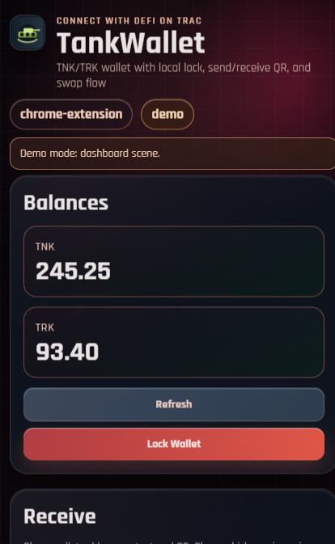
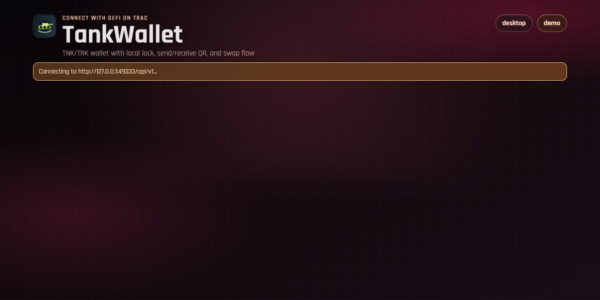

# TankWallet

## MAINTAINER TRAC ADDRESS
### `trac1h4rke4z3jgqr53dvqjx8vc5sw4mk4ccq9n4wyypdhmuqd3vtg8fser092p`

## Product Description
TankWallet is a self-custody TNK/TRK wallet designed for practical daily operations on Trac workflows.  
It combines secure vault-based key handling, fast send/receive actions, QR-native interactions, and built-in token swap in one interface.

The product is built for two usage modes:
- **Chrome extension** for lightweight, always-ready access.
- **Desktop app** for full operational sessions with stronger local control.

Its core value is simple: one wallet surface for identity, transfer, and conversion, without relying on centralized custody.

TankWallet is a TNK/TRK wallet project with:
- create/import wallet
- passphrase lock and auto-lock
- send and receive flow
- address QR + copy address
- QR scanner for recipient input
- token swap (TNK <-> TRK quote and execute)
- Chrome extension mode
- desktop app mode

## Product Screenshots

### Desktop Wallet Dashboard


### Chrome Extension Popup


### Onboarding Flow


## Fork and Tech Base
- Fork base (required): `https://github.com/TracSystems/intercom-swap`
- Wallet technology base (required): `https://github.com/Trac-Systems/trac-wallet`

The local swap flow in this project follows a lightweight intercom-swap style lifecycle:
`quote -> execute -> activity`.

## Security Model
- Mnemonic is encrypted at rest with `AES-256-GCM` + `PBKDF2`.
- Plain mnemonic is never returned by API.
- Wallet can be manually locked and auto-locks after inactivity.
- During phrase input, the app enables secure-input mode and blocks copy/cut on mnemonic fields.
- Desktop mode requests content protection while sensitive inputs are active.

## Project Structure
```text
projects/tank-wallet
  assets/
    logo-tank.svg
  desktop/
    main.cjs
    preload.cjs
  extension/
    manifest.json
    popup.html
    background.js
  server/
    index.js
    tankService.js
    cryptoVault.js
    storage.js
    constants.js
  ui/
    index.html
    app.css
    app.js
  scripts/
    serve-ui.mjs
    run-electron.cjs
    check.mjs
```

## Quick Start
From `projects/tank-wallet`:

```bash
npm install
```

Run local wallet bridge:
```bash
npm run bridge
```

Optional environment values:
- `TANKWALLET_PORT` (default `49333`)
- `TANKWALLET_AUTO_LOCK_MS` (default `300000`)
- `TANKWALLET_DATA_DIR` (default `${HOME}/.tankwallet`)

Open the UI in browser:
```bash
npm run ui
```
Then open: `http://127.0.0.1:4173/ui/index.html`

## Desktop App
```bash
npm run desktop
```

Desktop app behavior:
- launches local bridge automatically on port `49333`
- loads same wallet UI
- enables secure input bridge hooks from preload

## Chrome Extension
1. Open `chrome://extensions`
2. Enable Developer mode
3. Click "Load unpacked"
4. Select folder: `projects/tank-wallet`
5. Open TankWallet extension popup

The extension expects local bridge at `http://127.0.0.1:49333`.

## API Endpoints
- `GET /api/v1/health`
- `GET /api/v1/state`
- `POST /api/v1/wallet/create`
- `POST /api/v1/wallet/import`
- `POST /api/v1/wallet/unlock`
- `POST /api/v1/wallet/lock`
- `GET /api/v1/wallet/address`
- `GET /api/v1/wallet/address/qr`
- `POST /api/v1/send`
- `POST /api/v1/swap/quote`
- `POST /api/v1/swap/execute`
- `GET /api/v1/activity`

## Notes
- This is a project scaffold and local wallet simulation flow for TNK/TRK product design and integration planning.
- Before production deployment, add audited transaction signing and chain settlement integration.
